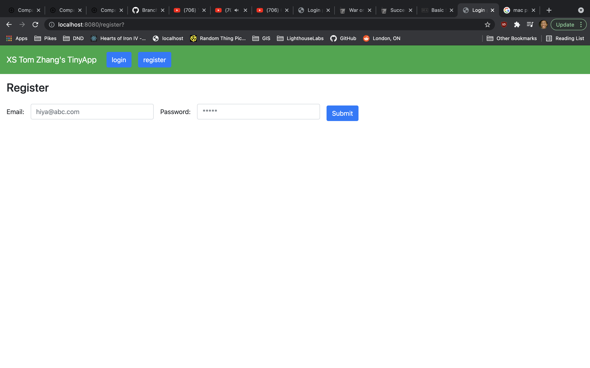
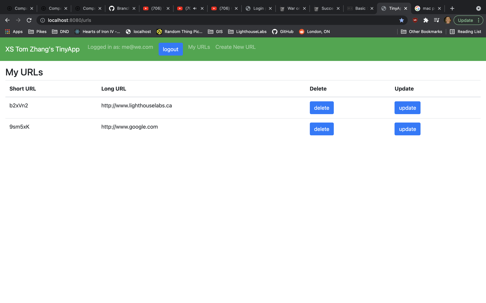
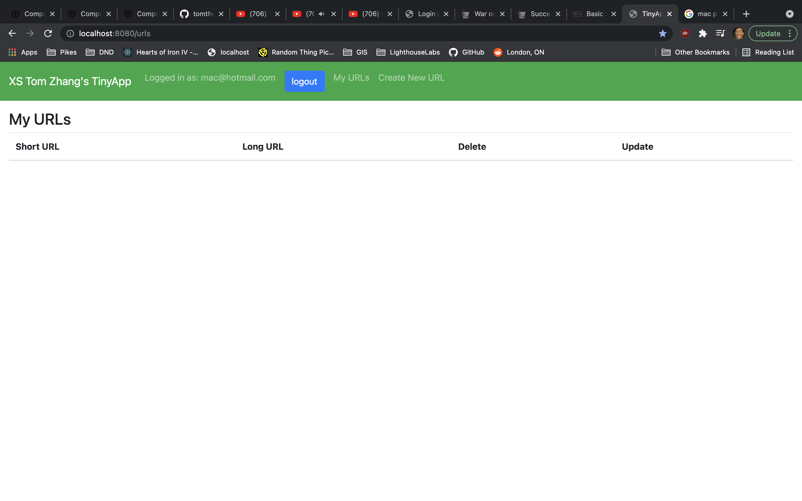
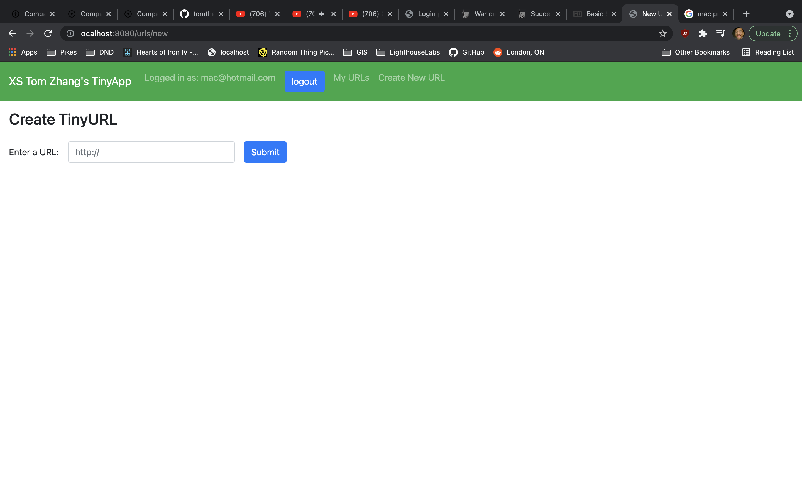
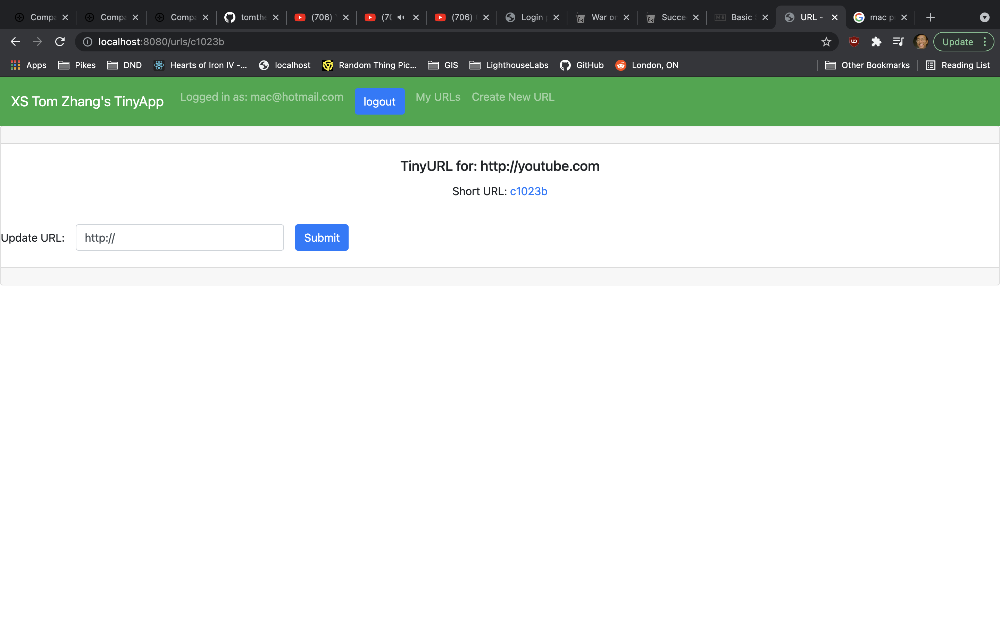

# Xin Sheng (Tom) Zhang's TinyApp Project

TinyApp is a web application built with Node and Express that allows users to shorten long URLs (à la bit.ly).

Pass in a long URL and watch become much shorter before your eyes :).

Then, you can share a the shortened url more flexibly.

## Final Product

## Dependencies

- Node.js
- Express
- EJS
- bcrypt
- body-parser
- cookie-session
- UUID

c1023b

## Getting Started

1. Install all dependencies (using the `npm install` command).
2.  Run the development web server using the `node start` command.

3. Open your http://localhost:8080/, if you change the port in express_server.js, you will need to change the port in the address

4. You will be directed to a login screen

5. Press the register button and input a username and password to be registered and go to the main screen

6. Click on "Create New URL" to go to the page to make urls shorter. 

7. Enter a Http:// url for conversion.

8. Click submit

9. Copy the Short Url address and you're ready to paste

## Things to note.

* The short url is for a locally hosted link, so is not usable while the server is offline

* Click the update and delete buttons on the page of urls to do appropriate adjustments.